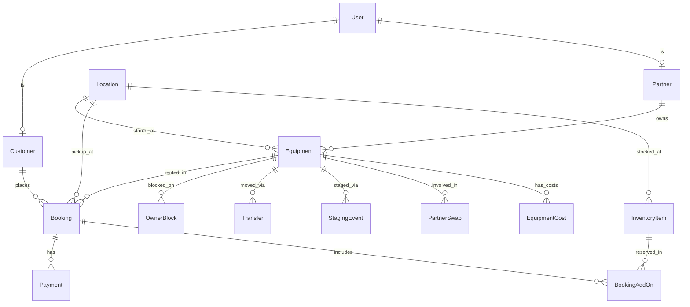

# Data Model

Reference schema for StarLink Mini Rental. Implement as **SQLite 3.46** SQL migrations — **no ORM**.

---

## SQLite setup

Run on every PDO connection:

```sql
PRAGMA journal_mode = WAL;
PRAGMA foreign_keys = ON;
PRAGMA busy_timeout = 5000;
```

- **File:** `website/data/starlink.db` (inside app root, not web-accessible)
- **IDs:** `INTEGER PRIMARY KEY AUTOINCREMENT`
- **Money:** store as `INTEGER` cents (e.g. $350.00 → `35000`)
- **Timestamps:** `TEXT` ISO-8601 UTC or `INTEGER` Unix time — pick one and stay consistent
- **Enums:** `TEXT` with CHECK constraints or app-level validation

---

## Entity Relationship Overview



---

## Users & Auth

### `users`

| Column | Type | Notes |
| --- | --- | --- |
| id | INTEGER | PK AUTOINCREMENT |
| email | TEXT | UNIQUE NOT NULL |
| password_hash | TEXT | `password_hash()` output |
| role | TEXT | `customer`, `admin`, `partner` |
| name | TEXT | |
| phone | TEXT | nullable |
| failed_login_count | INTEGER | default 0 |
| locked_until | TEXT | nullable; rate limit |
| remember_token_hash | TEXT | nullable |
| created_at | TEXT | |

### `customers`

| Column | Type | Notes |
| --- | --- | --- |
| user_id | INTEGER | PK, FK → users |
| default_address_json | TEXT | nullable; JSON for shipping |

Auth is **custom PHP**: session cookie after `password_verify()`, role checked on each admin/partner route.

---

## Partners

### `partners`

| Column | Type | Notes |
| --- | --- | --- |
| id | INTEGER | PK |
| user_id | INTEGER | FK → users UNIQUE |
| name | TEXT | |
| email | TEXT | |
| phone | TEXT | nullable |
| revenue_share_pct | REAL | nullable; future |
| created_at | TEXT | |

---

## Locations

### `locations`

| Column | Type | Notes |
| --- | --- | --- |
| id | INTEGER | PK |
| slug | TEXT | UNIQUE |
| name | TEXT | |
| location_type | TEXT | `store`, `home`, `warehouse` |
| address | TEXT | |
| city | TEXT | |
| province | TEXT | `AB` |
| hours_json | TEXT | nullable |
| is_customer_pickup | INTEGER | 0/1 |
| is_active | INTEGER | 0/1 |
| created_at | TEXT | |

**Seed:** `edmonton-outlet`, `edmonton-north`, `red-deer-bower`, `calgary-chinook` (Red Deer and Calgary inactive).

---

## Equipment

### `equipment`

| Column | Type | Notes |
| --- | --- | --- |
| id | INTEGER | PK |
| nickname | TEXT | |
| serial_number | TEXT | nullable |
| owner_type | TEXT | `admin`, `partner` |
| partner_id | INTEGER | FK nullable |
| purchase_date | TEXT | ISO date |
| purchase_cost_cents | INTEGER | CAPEX |
| starlink_account_email | TEXT | |
| data_plan | TEXT | e.g. `roam_50gb` |
| billing_cycle_start_day | INTEGER | 1–28 |
| current_storage_location_id | INTEGER | FK |
| at_pickup_site | INTEGER | 0/1 |
| rental_priority | INTEGER | lower = first; admin = 0 |
| status | TEXT | `active`, `maintenance`, `retired`, `with_customer` |
| notes | TEXT | nullable |
| created_at | TEXT | |

---

## Staging & Transfers

### `staging_events`

| Column | Type | Notes |
| --- | --- | --- |
| id | INTEGER | PK |
| equipment_id | INTEGER | FK |
| from_location_id | INTEGER | FK |
| to_location_id | INTEGER | FK |
| staging_date | TEXT | |
| ready_date | TEXT | staging_date + 1 day |
| related_booking_id | INTEGER | FK nullable |
| status | TEXT | `scheduled`, `completed`, `cancelled` |
| created_at | TEXT | |

### `transfers`

| Column | Type | Notes |
| --- | --- | --- |
| id | INTEGER | PK |
| equipment_id | INTEGER | FK |
| from_location_id | INTEGER | FK |
| to_location_id | INTEGER | FK |
| transfer_date | TEXT | |
| transit_days | INTEGER | default 1 |
| updates_at_pickup_site | INTEGER | 0/1 |
| notes | TEXT | nullable |
| created_by_user_id | INTEGER | FK |
| created_at | TEXT | |

---

## Blocks & Partner Swaps

### `owner_blocks`

| Column | Type | Notes |
| --- | --- | --- |
| id | INTEGER | PK |
| equipment_id | INTEGER | FK |
| start_date | TEXT | inclusive |
| end_date | TEXT | inclusive |
| reason | TEXT | `personal`, `maintenance`, `staging`, `other` |
| requested_by | TEXT | `admin`, `partner` |
| partner_swap_id | INTEGER | FK nullable |
| notes | TEXT | nullable |
| created_by_user_id | INTEGER | FK |
| created_at | TEXT | |

### `partner_swaps`

| Column | Type | Notes |
| --- | --- | --- |
| id | INTEGER | PK |
| partner_id | INTEGER | FK |
| partner_equipment_id | INTEGER | FK — stays rentable |
| loaner_equipment_id | INTEGER | FK — blocked for partner use |
| start_date | TEXT | |
| end_date | TEXT | |
| status | TEXT | `requested`, `approved`, `active`, `completed`, `denied` |
| notes | TEXT | nullable |
| created_at | TEXT | |

---

## Inventory Add-Ons

### `inventory_items`

| Column | Type | Notes |
| --- | --- | --- |
| id | INTEGER | PK |
| sku | TEXT | |
| name | TEXT | |
| description | TEXT | nullable |
| location_id | INTEGER | FK |
| quantity_total | INTEGER | |
| quantity_available | INTEGER | |
| rental_price_cents_per_day | INTEGER | nullable |
| rental_price_cents_flat | INTEGER | nullable |
| is_active | INTEGER | 0/1 |
| created_at | TEXT | |

### `booking_add_ons`

| Column | Type | Notes |
| --- | --- | --- |
| id | INTEGER | PK |
| booking_id | INTEGER | FK |
| inventory_item_id | INTEGER | FK |
| quantity | INTEGER | |
| unit_price_cents | INTEGER | locked at booking |
| line_total_cents | INTEGER | |

---

## Bookings

### `bookings`

| Column | Type | Notes |
| --- | --- | --- |
| id | INTEGER | PK |
| customer_id | INTEGER | FK |
| equipment_id | INTEGER | FK nullable until assigned |
| location_id | INTEGER | FK |
| fulfillment_type | TEXT | `store_pickup`, `home_appointment`, `mail_ship` |
| shipping_address_json | TEXT | required if mail_ship; Canada addresses |
| staging_date | TEXT | nullable |
| start_date | TEXT | inclusive |
| end_date | TEXT | inclusive |
| daily_rate_cents | INTEGER | locked at booking |
| rental_total_cents | INTEGER | |
| shipping_fee_cents | INTEGER | 0 or 15000 |
| deposit_cents | INTEGER | default 35000 |
| add_ons_total_cents | INTEGER | default 0 |
| is_admin_created | INTEGER | 1 for 30+ day / custom bookings |
| customer_notes | TEXT | nullable; preferred appointment times |
| appointment_status | TEXT | see below |
| confirmed_pickup_date | TEXT | nullable |
| confirmed_pickup_time_start | TEXT | nullable `HH:MM` |
| confirmed_pickup_time_end | TEXT | nullable `HH:MM` |
| proposed_pickup_date | TEXT | nullable |
| proposed_pickup_time_start | TEXT | nullable |
| proposed_pickup_time_end | TEXT | nullable |
| proposed_at | TEXT | nullable |
| appointment_confirmed_at | TEXT | nullable |
| status | TEXT | see below |
| agreement_accepted_at | TEXT | nullable |
| square_payment_id | TEXT | nullable |
| cancelled_at | TEXT | nullable |
| cancellation_fee_cents | INTEGER | nullable |
| created_at | TEXT | |

**Booking status:** `appointment_pending` → `pending_payment` → `confirmed` → `staged` → `picked_up` / `shipped` → `returned` | `cancelled` | `late`

**Appointment status** (when `fulfillment_type = home_appointment`):

| Value | Meaning |
| --- | --- |
| `awaiting_admin` | Customer submitted; Admin must confirm or propose |
| `proposed` | Admin set date/time range; customer must accept |
| `confirmed` | Pickup window agreed |
| `n/a` | Not home appointment |

Home appointments: confirm (or propose) **before** payment is captured.

**30+ day rentals:** Admin creates with `is_admin_created = 1`, custom `daily_rate_cents` / `rental_total_cents`; customer does not use self-serve flow.

---

## Payments (Square)

### `payments`

| Column | Type | Notes |
| --- | --- | --- |
| id | INTEGER | PK |
| booking_id | INTEGER | FK nullable |
| equipment_id | INTEGER | FK nullable |
| type | TEXT | `rental`, `deposit`, `deposit_refund`, `shipping`, `late_fee`, `cancellation_fee`, `damage_charge`, `addon` |
| amount_cents | INTEGER | positive = charge |
| square_payment_id | TEXT | nullable |
| square_order_id | TEXT | nullable |
| status | TEXT | `pending`, `completed`, `failed`, `refunded` |
| notes | TEXT | nullable |
| created_at | TEXT | |

---

## Equipment Costs

### `equipment_costs`

| Column | Type | Notes |
| --- | --- | --- |
| id | INTEGER | PK |
| equipment_id | INTEGER | FK |
| type | TEXT | `purchase`, `subscription`, `repair`, `accessory`, `other` |
| amount_cents | INTEGER | |
| description | TEXT | nullable |
| incurred_date | TEXT | |
| created_at | TEXT | |

---

## Availability Algorithm

**Input:** `location_id`, `fulfillment_type`, `start_date`, `end_date`

**Output:** ranked list of available `equipment_id`s

```php
// PDO + prepared statements; no ORM
$candidates = [];
foreach ($activeEquipment as $unit) {
    if (!passesStagingRule($unit, $locationId, $fulfillmentType, $startDate)) continue;
    if (hasOverlappingBooking($unit->id, $startDate, $endDate)) continue;
    if (hasOverlappingBlock($unit->id, $startDate, $endDate)) continue;
    if (isLoanerBlocked($unit->id, $startDate, $endDate)) continue;
    if (inTransit($unit->id, $startDate, $endDate)) continue;
    $candidates[] = $unit;
}
usort($candidates, fn($a, $b) => $a->rental_priority <=> $b->rental_priority);
return $candidates;
```

### Staging rule

```
store_pickup:
  if at_pickup_site AND at location → earliest = today
  else → earliest = today + 1 day

home_appointment:
  unit at home location; earliest start after admin confirms window

mail_ship:
  earliest = today + shipping_lead_days (admin config)
  shipping allowed anywhere in Canada
```

---

## Auto-Assignment

```php
$candidates = findAvailable($locationId, $fulfillment, $start, $end);
if (empty($candidates)) throw new BookingUnavailableException();
return $candidates[0]; // admin units first (rental_priority = 0)
```

---

## Pricing Tiers (configurable)

Daily rates come from **admin-configured tiers**, not hardcoded day boundaries. Store in `config/app.php` for v1 or a `pricing_tiers` table if Admin UI edits are needed early.

### `pricing_tiers` (optional table)

| Column | Type | Notes |
| --- | --- | --- |
| id | INTEGER | PK |
| min_days | INTEGER | inclusive |
| max_days | INTEGER | inclusive; nullable = open-ended |
| rate_cents_per_day | INTEGER | e.g. `2500` = $25/day |
| sort_order | INTEGER | first matching tier wins |
| is_active | INTEGER | 0/1 |
| created_at | TEXT | |

**Launch seed (example — adjust boundaries anytime):**

| min_days | max_days | rate_cents_per_day |
| --- | --- | --- |
| 3 | 7 | 2500 |
| 8 | 30 | 2000 |

Tier boundaries (including whether day 7 uses the short or long rate) are **operational config**, not fixed in code. The rental agreement reflects current published rates; update agreement text when defaults change materially.

---

## Pricing Calculation

```
days = inclusive_day_count(start, end)

if days < minimum_rental_days && !is_admin_created: reject
if is_admin_created: use admin-set rates
else:
  tier = first active pricing_tier where min_days <= days <= max_days
  if !tier: reject (or admin-created only if days > max self-serve tier)
  rate = tier.rate_cents_per_day

rental_total = days * rate  (or admin override)
shipping = mail_ship ? 15000 : 0
deposit = 35000
total_due = rental_total + shipping + add_ons_total + deposit
```

---

## Payoff Report (per equipment)

```
capex_cents = purchase_cost_cents + sum(costs where type in purchase, accessory)
ongoing_cents = sum(costs where type in subscription, repair, other)
revenue_cents = sum(payments where type in rental, late_fee, ...)
refund_cents = sum(abs(payments where type in deposit_refund))

profit_cents = revenue_cents - refund_cents - ongoing_cents
payoff_pct = profit_cents / capex_cents * 100
remaining_cents = max(0, capex_cents - profit_cents)
```

---

## Indexes

```sql
CREATE INDEX idx_equipment_priority ON equipment(rental_priority, status, at_pickup_site);
CREATE INDEX idx_equipment_partner ON equipment(partner_id);
CREATE INDEX idx_bookings_customer ON bookings(customer_id, status);
CREATE INDEX idx_bookings_equipment_dates ON bookings(equipment_id, start_date, end_date);
CREATE INDEX idx_bookings_location ON bookings(location_id, status);
CREATE INDEX idx_blocks_equipment_dates ON owner_blocks(equipment_id, start_date, end_date);
CREATE INDEX idx_staging_equipment ON staging_events(equipment_id, staging_date);
CREATE INDEX idx_transfers_equipment ON transfers(equipment_id, transfer_date);
CREATE INDEX idx_inventory_location ON inventory_items(location_id, is_active);
CREATE INDEX idx_users_email ON users(email);
```

---

## Migrations

Versioned SQL files, applied in order:

```
website/database/migrations/
├── 001_create_users.sql
├── 002_create_locations.sql
├── 003_create_equipment.sql
├── ...
└── 010_seed_edmonton.sql
```

Simple PHP CLI script: `php bin/migrate.php` runs pending migrations inside a transaction.
